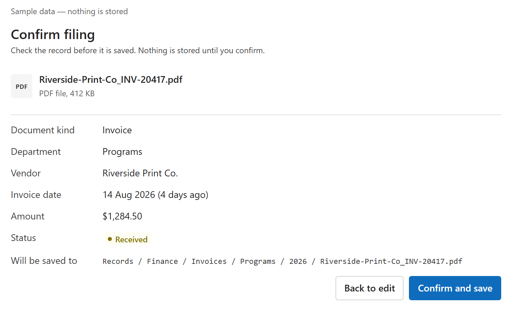
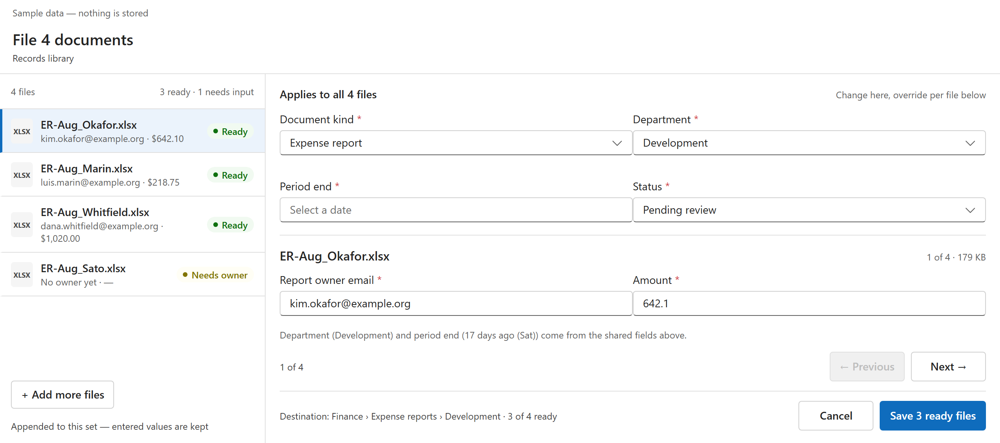
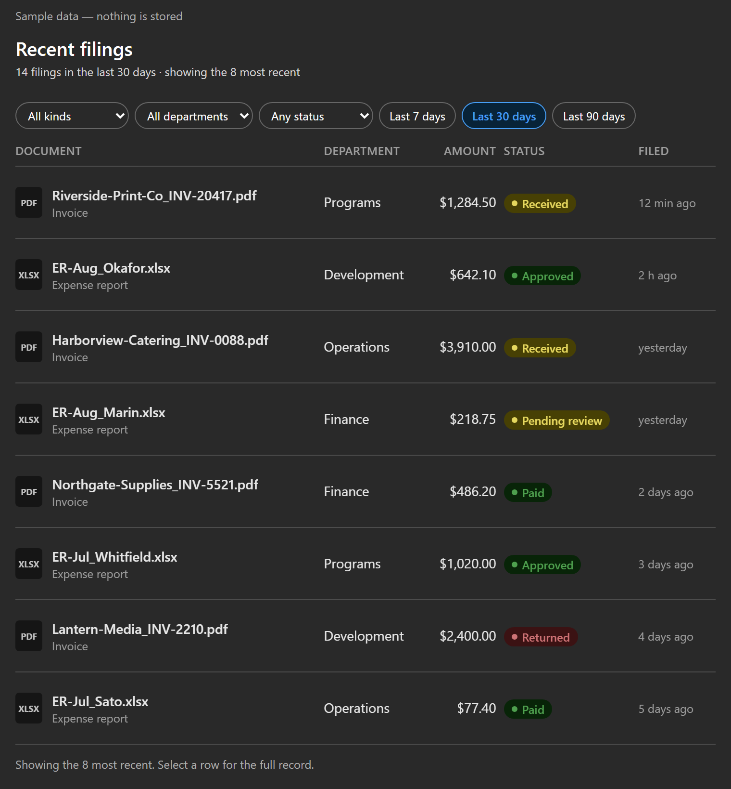

# Document Intake

> [!IMPORTANT]
> **Ready-made package:** deploy
> [file-uploader.sppkg](sharepoint/solution/file-uploader.sppkg) without building the
> project. Out of the box it runs on fictional sample data and says so on screen;
> nothing is stored until a tenant admin switches on the live SharePoint store
> ([docs/TENANT-SETUP.md](docs/TENANT-SETUP.md)).

> **Sample type:** SPFx Copilot Component with a live SharePoint store behind a tenant setting<br>
> **Catalog:** 1 tool (`fileDocuments`), 2 intents (`file`, `recent`), inline + full screen<br>
> **Agent:** Document Intake, a declarative agent packaged with the component


## Summary

Document Intake files a formal document — an invoice or an expense report — into
the right SharePoint document library with complete metadata, from inside a
Microsoft 365 Copilot conversation. The user chooses the file, the component asks
only for the fields that kind of document requires, and nothing is stored until
those fields are valid and the user confirms. A text answer can neither accept a
file nor enforce a records policy; this does both and hands back a receipt.

The same React component renders in two modes inside the Copilot canvas:

- a compact **inline** form that files one document end to end, and
- a **full-screen** workspace for several documents at once, with shared fields
  set once and adjusted per file.

A second intent, **recent filings**, shows the user's own filings with filters
and opens any record in SharePoint.

## Screenshots

### Inline



### Full screen



### Recent filings, dark mode



Every layout in light and dark, at narrow width and 200% zoom, is in
[`assets/`](./assets/), indexed by
[`assets/visual-evidence.json`](./assets/visual-evidence.json).

## Applies to

- [SharePoint Framework](https://learn.microsoft.com/sharepoint/dev/spfx/sharepoint-framework-overview) `1.24.0-beta.2` (Copilot Component)
- [Microsoft Copilot extensibility](https://learn.microsoft.com/microsoft-365-copilot/extensibility/) — declarative agents and Copilot Components preview
- React `17`, Fluent UI v9, PnPjs v4, Node.js `>=22.14.0 <23.0.0`
- [Microsoft 365 tenant](https://learn.microsoft.com/sharepoint/dev/spfx/set-up-your-development-environment) with the SharePoint App Catalog

> Get your own free development tenant by subscribing to the [Microsoft 365 developer program](https://aka.ms/m365/devprogram)

## Prerequisites

- Node.js `>=22.14.0 <23.0.0`
- A Microsoft 365 tenant with SPFx 1.24 (dev preview) enabled and a SharePoint App Catalog
- [Heft](https://heft.rushstack.io/) (`npm install -g @rushstack/heft`)
- For live filing only: PowerShell 7+, PnP.PowerShell 2.x+, and a records site
  (see [docs/TENANT-SETUP.md](docs/TENANT-SETUP.md))

> This solution uses the **Heft** build system (not Gulp) and **React 17**, aligned with the SPFx 1.24 dev preview.

## Contributors

- [Kurt Rolland](https://github.com/kurt-rolland)

## Version history

| Version | Date | Comments |
| ------- | ---- | -------- |
| 1.0 | September 11, 2026 | Initial release: filing (one file inline, several in full screen) and recent filings, on sample data |
| 1.0.5 | September 22, 2026 | Live SharePoint store behind a tenant setting; start-up never guesses between sample and live data |
| 1.0.8 | September 23, 2026 | First real filing from Copilot; agent package keeps its instructions file reference |
| 1.0.9 | September 24, 2026 | Open in SharePoint through Copilot's own link handling |
| 1.0.12 | September 24, 2026 | Files are chosen, not dragged; no Copy link; calendar dates on recent filings. Verified with a real filing in Copilot (receipt F-00174) |

## Disclaimer

**THIS CODE IS PROVIDED _AS IS_ WITHOUT WARRANTY OF ANY KIND, EITHER EXPRESS OR IMPLIED, INCLUDING ANY IMPLIED WARRANTIES OF FITNESS FOR A PARTICULAR PURPOSE, MERCHANTABILITY, OR NON-INFRINGEMENT.**

---

## Minimal Path to Awesome

1. Download and deploy [file-uploader.sppkg](sharepoint/solution/file-uploader.sppkg)
   to the tenant App Catalog.
2. Approve deployment for all sites when prompted.
3. Add the packaged **Document Intake** agent in Microsoft Copilot (App Catalog →
   **Manage apps** → the solution → **Add to Teams**), then install it to yourself
   from the Microsoft 365 admin centre → **Agents**.
4. Start with “File this invoice for the Programs team.” Choose a file, review,
   confirm. On sample data the receipt says so; nothing is stored.

To build locally:

```powershell
npm ci
npm run build
```

`npm start` runs the local Workbench at `https://localhost:4321`. Use
`npm run capture:visual` to regenerate the screenshots and visual evidence.

**Live filing into SharePoint** needs a records site and two tenant settings.
The scripted walkthrough — provision, verify, tenant test, deploy, first filing,
each step with what “done” looks like — is in
[docs/TENANT-SETUP.md](docs/TENANT-SETUP.md).

## Features

Records staff — finance and operations people at a non-profit — file formal
documents every day, where metadata is mandatory and audited. This sample lets
them do it from Copilot without leaving the conversation.

- **Complete records only.** No file reaches the library without every field its
  document kind requires. The kinds and their required fields come from the
  library's content types, not from the component.
- **The destination is derived, never chosen.** Kind and department decide the
  folder: an invoice for Programs goes to
  `Records/Finance/Invoices/Programs/2026`. There is no folder picker.
- **Copilot pre-fills, a person confirms.** “File this invoice for Programs,
  dated last Friday” fills department and date and marks them as pre-filled.
  The prompt never saves anything by itself: the user reviews a read-only
  summary with the exact destination and selects **Confirm and save**, the only
  step that writes.
- **A receipt, not a claim.** After saving, the user sees what was stored,
  where, a receipt number taken from the stored record, and **Open in
  SharePoint**. A save that fails partway rolls back and says so; a rollback
  that cannot finish names the file it left behind.
- **Several files at once** in the full-screen workspace: shared fields set
  once, each file's own fields adjusted, per-file readiness shown before saving.
- **Recent filings.** “What have I filed this week?” shows the user's own
  filings with filters for kind, department, status and period. Selecting a
  row shows the full record and opens it in SharePoint.
- **Honest sample mode.** Until a tenant admin switches it on, the component
  runs on fictional sample data (Brightwater Community Foundation) and says so
  on screen. Whether data is sample or live is never a tool argument.

This sample illustrates the following concepts:

- An SPFx 1.24 Copilot Component with one tool serving two intents, inline and
  full-screen views, and a declarative agent whose instructions tie every
  “the form is open” claim to an actual tool call
- A submit flow with draft, validation, review, confirm and receipt states,
  where only an explicit confirmation writes
- A swappable store behind one interface (`IDocumentStoreService`): a mock and
  a live SharePoint store (PnPjs v4) with identical views, selected by a
  tenant setting read once at start-up. The contract every store keeps is in
  [docs/STORE-CONTRACT.md](docs/STORE-CONTRACT.md)
- Required fields read from SharePoint content types, with a per-kind config
  map for what content types cannot express
- Three test loops: offline unit and view tests on every build, a tenant test
  (`npm run test:tenant`) that runs the shipped store against a real library,
  and the Copilot host last
- Scripted provisioning, verification and deployment with pre-flight checks

### Conversation starters

| # | Starter | Intent |
| ---: | --- | --- |
| 1 | File this invoice for the Programs team | `file` |
| 2 | Upload these expense reports from last month | `file` (full screen for several) |
| 3 | What have I filed this week? | `recent` |
| 4 | Show recent filings for Finance that are still pending | `recent` |
| 5 | What information does an expense report need before I file it? | text answer, no component |

## Validation status

The 24 September 2026 production build completed with zero lint warnings:

- 338 Jest tests passed, 0 failed, including the component lifecycle against the
  SDK's mock host, and a guard that fails the build on any drag-or-drop wording
  in the UI, the tool description or the agent instructions.
- 41 Playwright visual captures passed with 0 broken images or horizontal overflow.
- Tenant test (`npm run test:tenant`): 17 of 17 scenarios against a real records
  library, run as a filing user.
- In Microsoft 365 Copilot: the agent publishes from the `.sppkg`, the tool
  binds, a file chosen in the canvas is uploaded and filed with a receipt, the
  recent view reads it back, **Open in SharePoint** opens the file, and
  choosing two or more files opens the full-screen workspace in Copilot's
  side panel.
- The generated agent package keeps `$[file('instruction.txt')]`; the build
  fails if it is inlined, because SharePoint registers an inlined package with
  no callable tool.

All of the above ran in one Microsoft 365 development tenant, the author's.
The walkthrough in [docs/TENANT-SETUP.md](docs/TENANT-SETUP.md) has not yet
been run by someone else on another tenant; if a step does not look the way
it says, that is a finding — please open an issue.

Screen-reader output in the host remains an environment-specific gate and is
not claimed here.

## Solution structure

```text
src/copilotComponents/fileUploader/
  FileUploaderCopilotComponent.ts            entry point; resolves the store once, then mounts React
  FileUploaderCopilotComponent.manifest.json component + tool manifest
  FileUploaderCopilotComponentProperties.ts  Zod tool-input schema
  components/                                inline, full-screen and shared blocks
  logic/                                     filing and recent controllers, validation, dates, prefill
  models/                                    view models, seeds (relative time), config
  services/                                  IDocumentStoreService, mock store, SharePoint store, tenant settings
scripts/                                     build gates, visual capture, provisioning, verification, deploy
tenant-tests/                                the tenant test (loop 2) and fixture capture
copilot/                                     declarative agent, plugin stub, instructions, icons
docs/                                        TENANT-SETUP.md, STORE-CONTRACT.md, design sources
assets/                                      screenshots, visual evidence, sample.json
sharepoint/solution/                         ready-to-deploy package
```

## Limitations and support

- **Pre-release platform.** SPFx 1.24 Copilot Components are in preview: no SLA,
  and breaking changes between betas of the same version. This sample is built
  on `1.24.0-beta.2` because packages from `1.24.0-beta.3` inline the agent
  instructions, and SharePoint then registers the agent with no callable tool.
  Newer betas exist (`1.24.0-beta.4` and `beta.5` on npm as of September 24,
  2026); this sample has not been rebuilt on them. Beta.3's release notes
  describe build-time agent-manifest validation and an automatic Teams
  manifest version bump on component changes, which may change the two
  limitations below.
- **Files are chosen, not dragged.** In Copilot, a file dragged onto the
  component is attached to the chat instead of the form, so the component
  offers only **Choose a file**.
- **Open in SharePoint goes through Copilot's link check.** Copilot may say it
  could not verify the link; select **Continue anyway** and the file opens.
  Copilot's own citation links show the same dialog. There is no Copy link
  button, because the canvas does not allow clipboard access; the URL is shown
  as selectable text.
- **An agent's instructions cannot be updated after the first deploy (as of
  September 2026).** A new `.sppkg` updates the component and the tool, but
  **Add to Teams** answers “couldn't add” for an agent that already exists, so
  the agent's instructions, version and description stay as they were at the
  first add. Deploy the current package first.
- **The first call in a new chat can fail** with Copilot's “Something went
  wrong” card. Send the request again.
- **Report owners are email addresses.** The live store resolves them with
  SharePoint's `ensureUser`, which accepts nothing looser.
- **Filed records are read-only** in the component; corrections happen in
  SharePoint. No approval or payment routing after filing.
- For sample issues, use the repository issue tracker and include the prompt,
  host mode (inline or full screen), browser, a screenshot, and whether the
  problem reproduces in the local Workbench.

## Help

We do not support samples, but this community is always willing to help, and we want to improve these samples. We use GitHub to track issues, which makes it easy for community members to volunteer their time and help resolve issues.

You can try looking at [issues related to this sample](https://github.com/pnp/spfx-copilot-components/issues) to see if anybody else is having the same issues.

If you encounter any issues using this sample, [create a new issue](https://github.com/pnp/spfx-copilot-components/issues/new).

## References

- [Getting started with SharePoint Framework](https://learn.microsoft.com/sharepoint/dev/spfx/set-up-your-developer-tenant)
- [Heft documentation](https://heft.rushstack.io/)
- [PnPjs](https://pnp.github.io/pnpjs/)
- [Microsoft 365 & Power Platform Community](https://aka.ms/community/home) — guidance, tooling, samples and open-source controls for your Copilot, Microsoft 365 & Power Platform development

---

> Share your solution with others through the Microsoft 365 Patterns and Practices program to get visibility and exposure. Learn more from the [Microsoft 365 & Power Platform Community](https://aka.ms/community/home).


