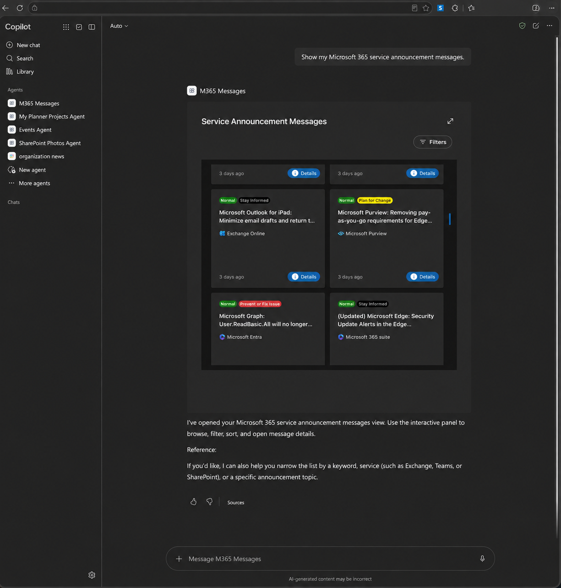
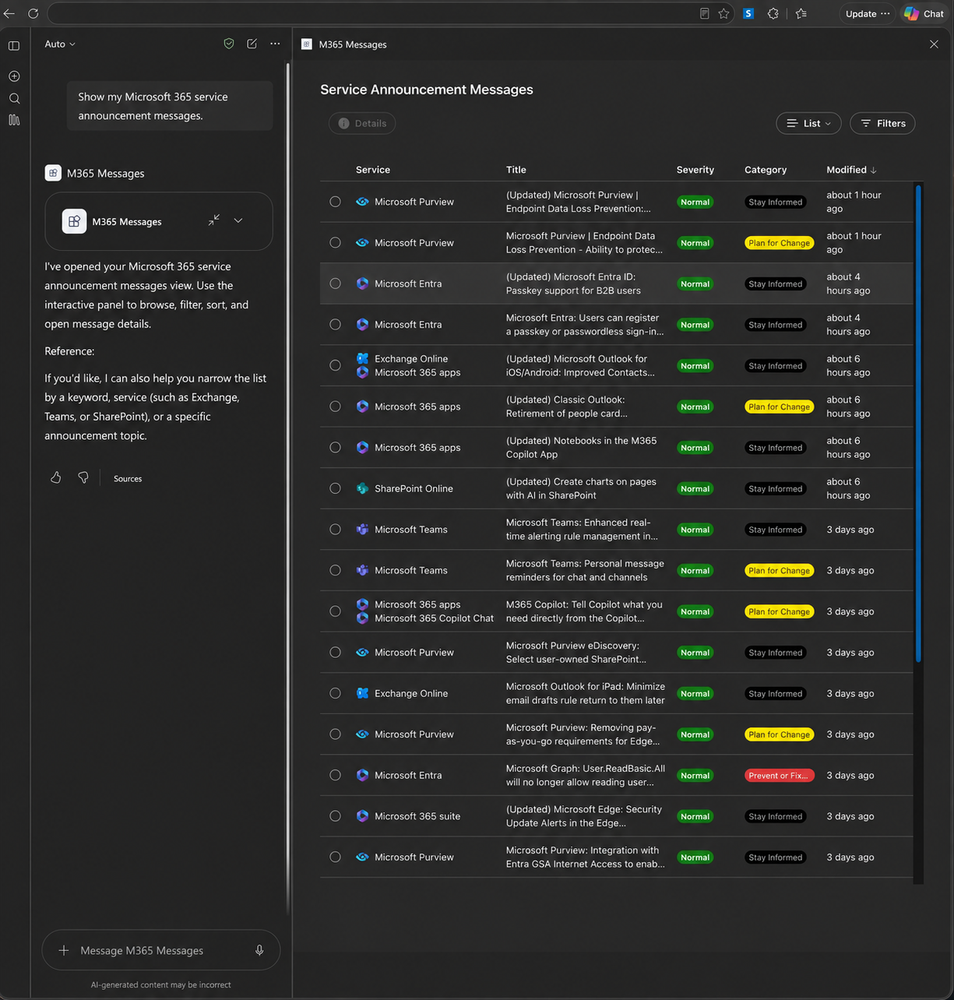
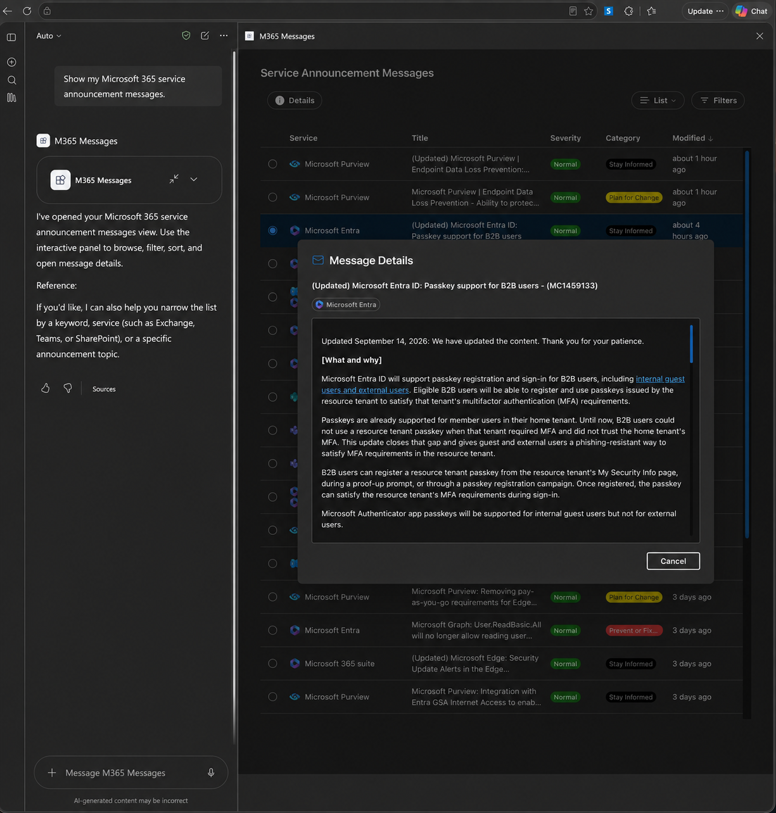

# M365 Messages

## Summary

M365 Messages is an SPFx Copilot component that opens Microsoft 365 service announcements in an interactive MCP App. It obtains a delegated Microsoft Entra token through SPFx, connects to the hosted M365 Messages MCP server, and renders the returned UI in a sandbox inside Microsoft 365 Copilot.

<a href="./assets/inline-anonymized.png"></a>

## Compatibility


SharePoint Copilot Apps and the APIs used by this sample are preview capabilities and are subject to change.

## Applies to

- [SharePoint Framework](https://learn.microsoft.com/sharepoint/dev/spfx/sharepoint-framework-overview)
- [Microsoft 365 Copilot extensibility](https://learn.microsoft.com/microsoft-365-copilot/extensibility/)
- [Microsoft 365 tenant](https://learn.microsoft.com/sharepoint/dev/spfx/set-up-your-development-environment)

## Contributors

- [João Mendes](https://github.com/joaojmendes)

## Version history

| Version | Date | Comments |
| --- | --- | --- |
| 1.0.3 | September 15, 2026 | Initial public release using SPFx 1.24.0-beta.3 and React 18. |

## Prerequisites

- Node.js `>=22.14.0 <23.0.0`.
- A Microsoft 365 tenant with a SharePoint App Catalog and access to SharePoint Copilot Apps.
- Permission to upload and deploy solutions to the tenant App Catalog and approve API access requests.
- Network access to `https://m365messages.spteckapps.com`.

The hosted API uses this multitenant Microsoft Entra application:

| Setting | Value |
| --- | --- |
| Display name | `FucAIAssistantSecured` |
| Application (client) ID | `c63423bf-bffe-4d00-b649-7e4fff124a05` |
| Delegated scope | `user_impersonation` |
| OAuth reply URL | `https://m365messages.spteckapps.com/oauth/callback` |
| Token resource | `api://mcp-m365-services.messages` |

The application object ID and home tenant ID are intentionally not required. They identify the publisher's directory and must not be copied into a consuming tenant.

## Minimal path to awesome

1. Clone this repository or [download this sample](https://pnp.github.io/download-partial/?url=https://github.com/pnp/spfx-copilot-components/tree/main/samples/m365-messages-copilot).
2. From `samples/m365-messages-copilot`, install dependencies and build the production package:

   ```bash
   npm ci
   npm run build
   ```

   For local development, replace `{tenantDomain}` in `config/serve.json` and `.vscode/launch.json`, run `npm start`, and open `https://{tenantDomain}/_layouts/15/copilotworkbench.aspx`.

3. Upload `sharepoint/solution/m365-messages-copilot.sppkg` to the tenant App Catalog and deploy it. Enable tenant-wide availability when prompted.
4. In the SharePoint admin center, open **Advanced** > **API access** and approve the pending `FucAIAssistantSecured` / `user_impersonation` request. During approval, SharePoint can create the multitenant application's service principal in the consuming tenant.
5. In the tenant App Catalog, use **Add to Teams** for the solution.
6. Make the **M365 Messages** agent available to the intended users and install it in Microsoft 365 Copilot.
7. Start a new chat with the agent and say: **Show my Microsoft 365 service announcement messages.**

The app can be deployed to different Microsoft 365 tenants because its API registration is multitenant. It is not installed automatically: each tenant administrator must deploy the SPFx package and explicitly approve the delegated API permission.

## Features

- Browse Microsoft 365 service announcements in inline and fullscreen layouts.
- Filter, sort, paginate, and open message details inside the embedded MCP App.
- Connect to an MCP server with Streamable HTTP and a fresh delegated bearer token.
- Render remote MCP App HTML in a sandbox without same-origin access.
- Forward link, follow-up message, and display-mode requests through the Copilot bridge.
- Match the Microsoft 365 Copilot light or dark theme.
- Use Fluent UI and SPTeck React Controls v2 for the component shell and status states.

## Architecture and authentication

`Microsoft 365 Copilot -> SPFx Copilot component -> delegated Entra token -> hosted MCP server -> sandboxed MCP App UI`

The SPFx component requests a token for `api://mcp-m365-services.messages`. The solution's `webApiPermissionRequests` entry uses the API display name, client ID, scope, and registered reply URL so SharePoint can create the enterprise application in a consuming tenant during permission approval.

API permissions approved through the SharePoint admin center are granted to the tenant's SharePoint Online Client Extensibility service principal and apply tenant-wide. Administrators should review the requested scope before approval and revoke it separately if the solution is removed.

## Data handling and security

- The component does not contain a client secret and does not persist access tokens.
- Delegated bearer tokens are sent only to `https://m365messages.spteckapps.com/mcp` in the `Authorization` header.
- The remote MCP App HTML executes in a sandbox with `allow-scripts allow-forms`; it does not receive `allow-same-origin`.
- The hosted MCP server and its source are not included in this repository. Reviewers and tenant administrators should treat it as an external service operated by the sample author.
- Microsoft 365 service announcement data is processed by the hosted service to provide the interactive experience.

See the sample's [privacy information](./PRIVACY.md) before deploying it to a tenant.

## Limitations

- SharePoint Copilot Apps are in preview and should not be used in production environments.
- The sample requires the externally hosted MCP endpoint to be available and accessible from the tenant.
- Tenant policies can prevent installation, enterprise-application creation, consent, or token issuance.
- The sample has no offline mode and does not include the MCP server implementation.
- Copilot tool selection and generated surrounding text can vary between conversations.

## Screenshots

### Fullscreen list

<a href="./assets/expand-anonymized.png"></a>

### Message details

<a href="./assets/details-anonymized.png"></a>

## Help

We do not support samples, but this community is always willing to help, and we want to improve these samples. Search the [repository issues](https://github.com/pnp/spfx-copilot-components/issues) for related reports or [create a new issue](https://github.com/pnp/spfx-copilot-components/issues/new) with reproduction steps.

## Disclaimer

**THIS CODE IS PROVIDED _AS IS_ WITHOUT WARRANTY OF ANY KIND, EITHER EXPRESS OR IMPLIED, INCLUDING ANY IMPLIED WARRANTIES OF FITNESS FOR A PARTICULAR PURPOSE, MERCHANTABILITY, OR NON-INFRINGEMENT.**

## References

- [Overview of SharePoint Copilot Apps](https://learn.microsoft.com/sharepoint/dev/spfx/copilot/overview-copilot-apps)
- [Build your first SharePoint Copilot App](https://learn.microsoft.com/sharepoint/dev/spfx/copilot/get-started/build-your-first-copilot-app)
- [Connect to Entra ID-secured APIs in SharePoint Framework solutions](https://learn.microsoft.com/sharepoint/dev/spfx/use-aadhttpclient)
- [Microsoft Graph service communications API overview](https://learn.microsoft.com/graph/service-communications-concept-overview)
- [Microsoft 365 Patterns and Practices](https://aka.ms/m365pnp)


