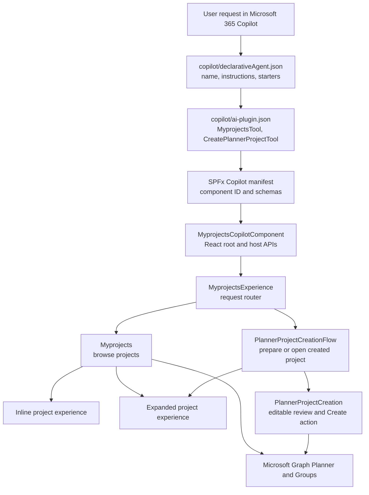
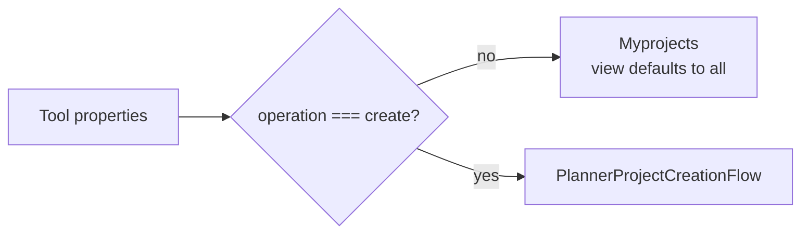
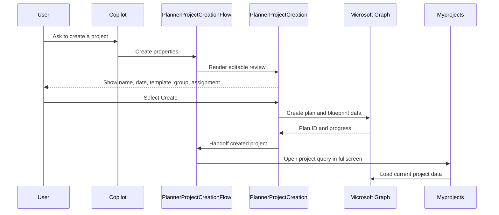

# My Planner Projects Copilot Agent

## Purpose

My Planner Projects is an SPFx 1.24 Copilot declarative agent. It gives a user an interactive view of Microsoft Planner projects they can access, helps them find work that needs attention, and prepares new Planner projects from natural-language requests.

The agent has two deliberately separate responsibilities:

- **Read and explore:** load accessible plans, tasks, and buckets; calculate project summaries; filter the results; and render an interactive project experience.
- **Prepare and create:** interpret a request for a new project, render an editable review, and write to Microsoft Graph only after the user selects the Create button.

The rendered experience owns rich project and task details. The conversational response stays concise and directs the user to the component.

## Architecture At A Glance



The component ID is `0452de39-61e2-43e2-a15a-c1b482a9e5d3`. The manifest advertises `inline` and `fullscreen` display modes.

## Request Contract

The agent instruction file, `copilot/instruction.txt`, translates natural language into one of the two tool property shapes.

### Browsing projects

`MyprojectsTool` accepts the following concepts:

- `view`: `all`, `active`, `urgent`, `overdue`, or `onHold`.
- `projectName`: an optional partial project title.
- `assignedToMe`: restricts task matching to the current user.
- `dateField` and `dateRange`: filter by activity, project creation, or task due date.
- `fromDate` and `toDate`: inclusive custom dates in `YYYY-MM-DD` format.
- `sortBy`: title, recent activity, created date, or next due date.
- `maxResults`: an optional limit from 1 to 50.

The default view is `all`. Filters are combined: a project must satisfy the project filter and have a task satisfying all requested task filters. Activity is derived from task creation, completion, and assignment timestamps because Planner does not provide a general last-edited timestamp.

`onHold` is a project convention rather than a native Planner status. It matches incomplete tasks in buckets named `On hold`, `Hold`, `In hold`, or `Blocked`, after whitespace and separator normalization.

### Creating a project

`CreatePlannerProjectTool` accepts:

- `operation: "create"`.
- The exact requested `projectName`.
- A resolved `startDate` in `YYYY-MM-DD` format.
- A template: `basicPlan`, `simplePlan`, `projectManagement`, `softwareDevelopment`, `businessPlan`, or `employeeOnboarding`.
- `assignPlanningAndDevelopmentToMe`, when the user explicitly requests self-assignment.

The tool call prepares a review. It does not mean that Graph has already created the project. The rendered Create button is the confirmation boundary.

## Configuration And Registration

| File | Responsibility |
| --- | --- |
| `copilot/declarativeAgent.json` | Defines the declarative agent name, version, instructions, conversation starters, and action reference. |
| `copilot/instruction.txt` | Defines intent mapping, property rules, template selection, date handling, and response behavior. |
| `copilot/ai-plugin.json` | Describes the plugin namespace and the two tools exposed to Copilot. |
| `config/copilot-agent.json` | Registers the agent and associates it with the SPFx component ID. |
| `MyprojectsCopilotComponent.manifest.json` | Declares the Copilot UX component, display modes, tool names, descriptions, and generated property schemas. |
| `MyprojectsCopilotComponentProperties.ts` | Defines the Zod schemas used to validate and generate tool property JSON schemas. |

The two tool schemas share one component, but the runtime distinguishes them by the presence of `operation: "create"`.

## Runtime Lifecycle

### 1. Host mounting

`MyprojectsCopilotComponent` extends `BaseCopilotComponent`. On the first render it creates a React DOM root in the host-provided `domElement`; subsequent renders reuse that root. It passes the SPFx context, Graph client factory, host context, tool properties, localization strings, and display-mode/size callbacks to `MyprojectsExperience`.

On teardown it unmounts the React root. This matters because Copilot display-mode changes can destroy and recreate the component or move it between iframe contexts.

### 2. Request routing

`MyprojectsExperience` is the narrow application router:



For a creation request it renders `PlannerProjectCreationFlow` with a key derived from the host instance and creation properties. This prevents a new creation invocation from inheriting stale local React state. For a browsing request it renders `Myprojects`, ensuring that an omitted view becomes `all`.

## Browsing Flow

### Data loading

`Myprojects` calls `usePlannerProjects`, which:

1. Obtains a Microsoft Graph client version 3 from `MSGraphClientFactory`.
2. Reads the user's plans from `/me/planner/plans`.
3. Reads Microsoft 365 groups the user belongs to through `graphPlannerGroups`.
4. Reads plans for those groups from `/groups/{groupId}/planner/plans`.
5. Removes duplicate plans by plan ID.
6. Reads tasks and buckets for each plan from `/planner/plans/{planId}/tasks` and `/planner/plans/{planId}/buckets`.
7. Converts Graph records into internal Planner models and marks tasks assigned to the current user.
8. Summarizes each project and applies the request filters.

Collection paging follows Graph `@odata.nextLink` values. Group-plan and plan-detail requests are processed in bounded batches of four to avoid issuing an unbounded number of concurrent requests. Errors from an individual group plan request are isolated, while a failure of the main load is exposed to the UI.

### Summaries and filtering

`plannerProjects.ts` contains the domain rules. `summarizePlannerProject` calculates:

- Total, active, and completed tasks.
- Tasks assigned to the current user.
- Urgent tasks: incomplete tasks due now or within seven days.
- Overdue tasks: incomplete tasks whose due date has passed.
- On-hold task IDs and count.
- The latest derived activity timestamp.
- The next upcoming due date.

The same module resolves calendar ranges such as today, this week, last month, rolling seven/30-day periods, and custom dates. Project creation dates are filtered at project level; activity and due dates are evaluated against task data.

### Inline view

`PlannerInlineView` is the normal browsing surface. It receives the filtered projects, loading/error state, query, refresh callback, localization, and a ref for host-size measurement. It chooses the appropriate empty, error, loading, list, or focused-summary presentation.

`PlannerProjectCard` renders one project summary. It exposes two different actions:

- Open the native Planner web experience using `plannerLinks.ts`.
- Select the project for the Copilot expanded view.

`PlannerProjectStatusBadges` presents calculated active, urgent, overdue, assigned, and on-hold indicators. `PlannerEmptyState` presents the no-results or no-access state.

## Selection And Fullscreen Flow

When a user selects a card, `Myprojects`:

1. Updates the selected project ID synchronously with `flushSync`.
2. Saves only that ID in `sessionStorage` under a key derived from the query properties.
3. Requests Copilot fullscreen when the host supports it.
4. Reloads or rerenders the component in fullscreen.
5. Restores the ID, clears the temporary storage entry after loading, and resolves the complete project from the loaded Graph results.

Storage never contains the complete project object. `selectPlannerProject` maps the restored ID to the current in-memory project summary. If there is exactly one project, or fullscreen has no explicit selection, it can use the first project as a fallback.

The selection entry expires after 30 seconds. This short lifetime bridges component/iframe recreation without becoming a long-term preference or leaking a stale selection into a later Copilot request. Storage access is guarded because sandboxed hosts can expose `sessionStorage` while denying reads or writes.

## Expanded Experience

`PlannerExpandedView` is rendered when fullscreen has a resolved project. It owns the expanded local view state:

- Planner board view, selected by `PLANNER_VIEW_KEY`.
- Gantt view, selected by `GANTT_VIEW_KEY`.
- Gantt scale, with `DEFAULT_GANTT_SCALE` as the initial value.

It passes the complete project summary to the active visualization and supplies the compact callback that returns the host to inline mode.

| Component | Responsibility |
| --- | --- |
| `PlannerExpandedHeader` | Displays the project context, compact action, view selector, and Gantt scale selector. |
| `PlannerViewSelector` | Builds localized Planner/Gantt options with `createPlannerViewOptions`. |
| `PlannerScaleSelector` | Builds localized Gantt scale options with `createGanttScaleOptions`. |
| `PlannerControl` | Renders the native Planner board integration and its loading/scroll surface. |
| `PlannerGanttView` | Converts project tasks into a chronological Gantt visualization using the selected scale. |
| `PlannerDisplayModeButton` | Provides the display-mode action used by the host-facing UI. |

Static keys and option definitions live in `constants/plannerExpandedView.constants.tsx`. Option construction and runtime type guards live in `utils/plannerExpandedView.ts`.

## Project Creation Flow

Creation is intentionally separate from project browsing.



`PlannerProjectCreationFlow` asks `usePlannerCreationNavigation` whether a previously created project should be reopened. If not, it renders `PlannerProjectCreation`.

`PlannerProjectCreation` owns the review and creation UI in one component. It uses shared controls for the project name, start date, template dropdown, Microsoft 365 group picker, assignment option, progress messages, and Create/Open actions. `useMicrosoft365Groups` loads groups on demand, debounces search, and pages results; `usePlannerProjectCreation` owns the Graph write state and progress result. The flow itself remains owned by `PlannerProjectCreationFlow` and `PlannerProjectCreation`.

### Blueprint creation

`plannerBlueprints.ts` defines the supported template blueprints: buckets, tasks, dates, and optional assignment behavior. `plannerProjectCreation.ts` coordinates creation and URL reuse. The creation process can report partial progress and resume remaining setup without duplicating already-created buckets or tasks.

The Graph write path is therefore:

1. Create or identify the Planner plan in the selected Microsoft 365 group.
2. Create the template buckets.
3. Create scheduled tasks from the selected blueprint.
4. Optionally assign the blueprint's key work to the current user.
5. Persist the created plan handoff and offer to open it.

A project is not described as created until the explicit Create action has started the write operation.

### Cross-display-mode handoff

`usePlannerCreationNavigation` stores a short-lived transfer before requesting fullscreen. The transfer contains the project ID and name, plus a derived browse query. After the new component instance appears, `readPlannerCreationTransfer` validates the mode and expiry, accepts the transfer once, and removes it. A failed display-mode request cancels the transfer.

This is separate from the normal selection key because creation requests have different identity: instance ID, project name, start date, template, and assignment choice are included in their storage keys.

## Supporting Modules

| Module | Role |
| --- | --- |
| `utils/graphPlanner.ts` | Graph paging, plan/task/bucket retrieval, Graph-to-domain conversion, deduplication, and bounded concurrency. |
| `utils/graphPlannerGroups.ts` | Microsoft 365 group search and paging for creation and plan discovery. |
| `utils/plannerProjects.ts` | Project summarization, status rules, date ranges, sorting, and filtering. |
| `utils/plannerGantt.ts` | Converts Planner tasks to Gantt rows, applies fallback dates, and sorts chronologically. |
| `utils/plannerBlueprints.ts` | Static template definitions and bucket/task blueprint data. |
| `utils/plannerProjectCreation.ts` | Plan creation helpers and setup/reuse behavior. |
| `utils/plannerComponent.ts` | Native Planner component support. |
| `utils/plannerLinks.ts` | Generates the Microsoft Planner web URL for a plan. |
| `utils/plannerSelection.ts` | Session-storage selection, creation-open state, and display-mode transfer. |
| `utils/plannerExpandedView.ts` | Localized view/scale option builders and type guards. |
| `hooks/usePlannerProjects.ts` | Async project loading, refresh, and filtered state. |
| `hooks/useMicrosoft365Groups.ts` | Microsoft 365 group search, debouncing, and paging for the creation picker. |
| `hooks/usePlannerProjectCreation.ts` | Creates a plan, applies its blueprint, reports progress, and supports resuming partial setup. |
| `hooks/usePlannerCreationNavigation.ts` | Creation handoff, fullscreen transitions, and reopening the created project. |
| `hooks/useCopilotContentHeight.ts` | Measures available Copilot content height for creation and expanded surfaces. |
| `hooks/useInlineCopilotContentSize.ts` | Keeps inline Copilot content sized to its rendered state. |
| `hooks/usePlannerScrollAreaHeight.ts` | Calculates the expanded scroll area height. |
| `hooks/useLockDocumentViewport.ts` | Prevents the host document from scrolling incorrectly in fullscreen. |

The `models` directory contains the contracts for component props, Graph records, Planner domain objects, hook state, creation handoffs, view state, and styles. The `types` directory contains narrower supporting types.

## Theme, Localization, And Accessibility

The root experience selects Fluent UI's light or dark web theme from `hostContext.theme`, applies it through `FluentUIProvider`, and supplies the host document for portals. Components use the shared React Controls v2 primitives and localized strings from `loc/en-us.js` with declarations in `loc/mystrings.d.ts`.

The host culture is passed as `dateLocale`, so dates can be formatted for the current page culture. Controls expose names and labels through the localized strings, and the design separates native Planner navigation from the Copilot fullscreen action so the intent of each action is clear.

## Testing Strategy

The Jest suite focuses on the decision-heavy boundaries:

- `plannerProjects.test.ts`: task status, urgency, on-hold conventions, dates, sorting, and combined filters.
- `graphPlanner.test.ts`: Graph response conversion, paging, deduplication, and request behavior.
- `plannerBlueprints.test.ts`: template blueprint content and assignment rules.
- `plannerGantt.test.ts`: date fallback and chronological task transformation.
- `plannerSelection.test.ts`: expiry, query-scoped selection, creation handoffs, validation, and sandboxed storage behavior.
- Component tests cover routing, project rendering, and card actions.

The tests use React DOM roots and `React.act` rather than the deprecated `react-test-renderer` APIs.

## Build, Package, And Deploy

Use Node.js `>=22.14.0 <23.0.0`.

```bash
npm install
npm start
npx tsc --noEmit
npm run build
```

`npm start` runs the Heft development server at `https://localhost:4321`; update the tenant host in `config/serve.json` before using Copilot Workbench.

The production build runs the test/lint/build pipeline and packages the solution. Expected outputs are:

- `teams/my-planner-projects-agent.zip`
- `sharepoint/solution/spfx-my-projects-agent.sppkg`

Stop an active `heft start` watcher before packaging. Otherwise hot-update assets can be copied into the package and produce noisy or invalid solution contents.

## Permissions And Operational Boundaries

The solution requires delegated Microsoft Graph permissions approved by SharePoint administration:

- `Tasks.ReadWrite` for reading and creating/updating Planner work.
- `GroupMember.Read.All` for discovering Microsoft 365 groups the user belongs to.

The agent only considers data returned for the current user's accessible plans and groups. Storage is temporary and scoped by query or creation identity. Graph errors are surfaced as an inline error state, while empty results are represented separately so the user can distinguish no matches from a failed request.
