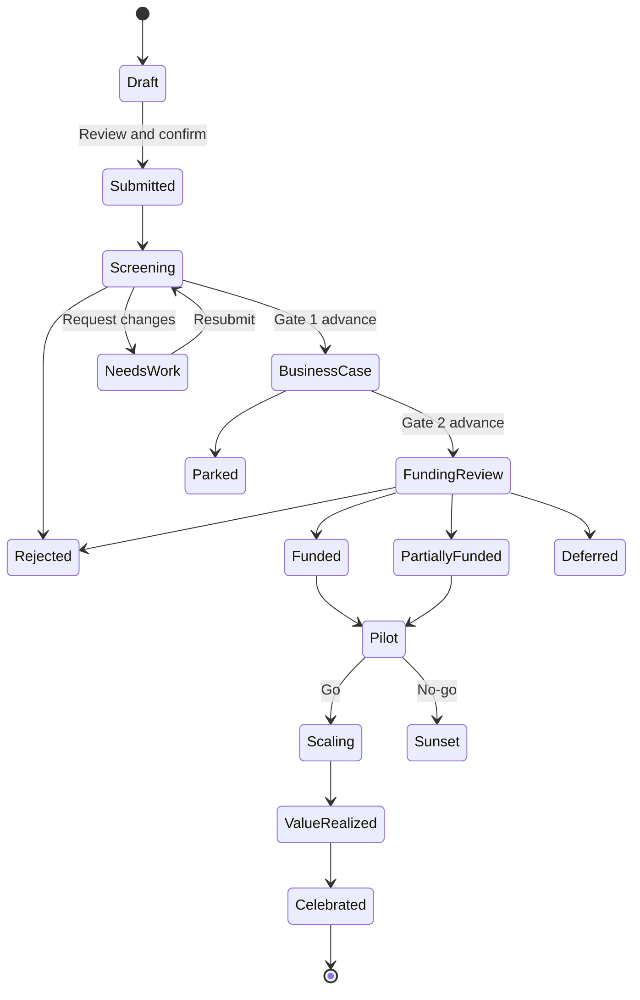

# Zava Innovation Hub - Copilot Components sample

> **Release candidate:** This offline, mock-data sample demonstrates how Microsoft 365 Copilot can turn
> natural-language intent into focused, interactive business UX. Inline components complete immediate
> work; full screen preserves that context while adding application-scale comparison and governance.
> The implementation follows [agentic-creation-rules.md](agentic-creation-rules.md); current validation
> status and external prerequisites are tracked in [todo.md](todo.md).

## Screenshots

| Enterprise Insights | Global participation |
| --- | --- |
|  |  |

| Idea submission | Review queue |
| --- | --- |
|  |  |

## Business story

**An employee has an idea. The organization helps shape it, makes a governed investment decision,
learns from the pilot, realizes value, and celebrates the people who made it happen.**

Most innovation portals make employees navigate forms, lists, dashboards, and approval sites. This
sample shows a different model:

1. A person describes a need naturally in Copilot.
2. Copilot selects one bounded experience and initializes it from the conversation.
3. The person works in a purpose-built inline form, review, decision, or visualization.
4. Deterministic UX owns calculations, validation, state changes, and confirmation.
5. Full screen continues from the exact idea, cohort, filter, draft, or funding scenario when broader
   context is useful.

The domain is innovation management, but the reusable message is **dynamic UX based on user intent**.
The same agent can present a submission workflow, investment model, review queue, interactive portfolio
visual, or recognition moment without sending the user to another application.

## Market-informed product position

This is a directional design benchmark, not a procurement comparison or claim of feature parity. Public
product pages reviewed on 2026-08-27 show a consistent enterprise innovation baseline:

- Brightidea emphasizes challenges, global employee collaboration, idea pipelines, stage gates,
  evaluation, social collaboration, analytics, and ROI tracking.
- HYPE positions innovation as a connection between strategy, ideation, ecosystems/scouting, execution,
  analytics, and measurable impact across several innovation roles.
- Planview IdeaPlace describes challenge templates, idea capture, voting/collaboration, consolidation,
  evaluation workflows, portfolio/project handoff, engagement, and executive reporting.
- Wazoku describes challenge-driven workflows, communities and co-creation, analytics, AI-assisted
  duplication/content discovery, portfolio management, and integration with enterprise tools.
- Qmarkets frames an end-to-end ecosystem spanning ideas, continuous improvement, foresight, technology
  scouting, portfolios, configurable processes, and impact defined from the beginning.

Reference pages: [Brightidea](https://www.brightidea.com/innovation-management-software),
[HYPE Innovation](https://www.hypeinnovation.com/),
[Planview IdeaPlace](https://www.planview.com/products-solutions/products/ideaplace/),
[Wazoku Platform](https://www.wazoku.com/wazoku-platform/), and
[Qmarkets](https://qmarkets.net/products/).

The market validates the need for a complete operating system, but this sample should not imitate a
traditional portal screen for screen. Its differentiator is the **agentic interaction model**:

| Traditional platform pattern | Copilot Components modernization |
| --- | --- |
| People learn navigation, forms, taxonomies, and process location. | People state the job naturally; Copilot selects one bounded component and initializes the right entity, scope, or draft. |
| Intake begins when someone finds the correct campaign or form. | A conversational signal can become a challenge, idea draft, duplicate check, or evidence request in the current flow of work. |
| Dashboards are destinations users must visit and configure. | A decision-specific chart appears inline for the current intent; full screen adds coordinated analysis without losing context. |
| Workflow automation moves records but often separates evidence from decisions. | The review component assembles exact evidence and consequences, while the human owns the deterministic decision and confirmation. |
| Collaboration depends on returning to the innovation portal. | Follow-ups, feedback, praise, and next actions can surface where people already work, with future Teams/Graph connectors behind stable UI contracts. |
| AI is commonly an assistant inside the platform. | AI performs intent resolution and bounded handoff; components own trusted records, calculations, controls, safeguards, and receipts. |

The sample is therefore **not a replacement claim for mature innovation suites**. It demonstrates how
their end-to-end operating model can become lower-friction, role-aware, and conversation-native while
remaining governable and integration-ready.

## End-to-end operating model

The design covers the lifecycle from strategic demand to measured impact, not merely an idea inbox:

| Lifecycle phase | Business job | Agentic experience | Current owner |
| --- | --- | --- | --- |
| 1. Direction | Translate strategy, customer pain, or operational need into a measurable challenge. | Copilot shapes an outcome, audience, constraints, evaluation criteria, timeline, and challenge brief. | `LaunchInnovationChallenge` |
| 2. Signals and opportunity | Bring observations, trends, prior ideas, and external signals into the problem. | Relevant internal evidence and similar ideas appear in context; external scouting is a future service-backed extension. | Challenge and submission dynamic evidence |
| 3. Ideation and participation | Capture and improve contributions from employees and collaborators. | Prompt-prefilled idea canvas, duplicate evidence, scoring, feedback, supporters, and global participation views. | `SubmitInnovationIdea`, `GetMyInnovation`, `ExploreGlobalInnovation` |
| 4. Triage and shaping | Separate promising concepts from noise and strengthen their case. | Ranked queue, cohort comparison, evidence gaps, gate decision, and live business-case modeling. | `GetInnovationReviewQueue`, `ReviewIdeaGate`, `BuildIdeaBusinessCase` |
| 5. Investment | Allocate scarce capital against strategy and portfolio constraints. | Funding scenario and confirmation beside budget, balance, value, and milestone consequences. | `ReviewInnovationFunding`, `TrackInnovationBudget` |
| 6. Experiment and learn | Turn assumptions into a measurable pilot and make evidence-based go/no-go decisions. | Hypothesis, experiment design, success thresholds, milestones, observations, learning, and guarded recommendation. | `ManageInnovationExperiment` |
| 7. Scale and execute | Move validated concepts toward rollout while retaining strategic and financial traceability. | Stage progression, milestone evidence, ownership, and portfolio context continue from the same idea graph. | Experiment, portfolio, and value routes |
| 8. Realize value | Compare promised outcomes with measured operational or financial impact. | Projected-versus-actual value, confidence, variance, at-risk outcomes, and accountable owners. | `TrackInnovationValue` |
| 9. Learn and recognize | Reuse knowledge and celebrate specific contributions that produced outcomes. | Grounded executive brief, reusable evidence, and a reviewed recognition artifact tied to realized value. | `GenerateInnovationBrief`, `CelebrateInnovationImpact` |
| 10. Govern and improve | Improve reach, velocity, balance, inclusion, and return across the innovation system. | Growth, geography, portfolio health, and leadership views reveal where the operating model needs action. | `GetInnovationGrowth`, `ExploreInnovationPortfolio`, `GetInnovationPortfolioHealth` |

The current sample supports an employee/corporate innovation program deeply. Technology scouting,
startup/partner ecosystems, patents, customer crowds, configurable methodology administration, and
durable project-system execution are documented extension points. They should reuse the same scenario,
workflow, and view-model contracts rather than become decorative placeholder tools.

## Showcase objectives

| Objective | Keynote proof |
| --- | --- |
| Make inline UX the hero | Distinct prompts resolve to visibly different, interactive components rather than generic generated cards. |
| Demonstrate meaningful adaptation | Prompt parameters and controls materially change records, calculations, chart geometry, selections, or workflow stages. |
| Complete work in conversation | Idea submission, gate review, funding review, and recognition reach explicit review and mock confirmation inside Copilot. |
| Show exact continuation | **View in full screen** opens the owning lens and focused route with current context intact. |
| Tell one governed story | Connected data supports intake, triage, business case, funding, pilot, value realization, and recognition. |
| Deliver premium visual quality | A living funnel, portfolio visuals, accountable people, deliberate motion, and editorial composition create a keynote-ready experience. |

Success is not measured by component count. Each routed component must earn its place through at least
two of these qualities: frequent or time-sensitive value, meaningful prompt variation, useful
interaction or review, distinctive visualization, and natural full-screen continuation.

## Audiences and lenses

| Lens | Demo persona | Core question |
| --- | --- | --- |
| **My Innovation** | Megan Bowen, Senior Program Manager and innovator | What should I submit or strengthen, where are my ideas, and how is my contribution recognized? |
| **Programs & Pilots** | Johanna Lorenz, Product Director and innovation program lead | Which challenges should we run, where is participation weak, and what are pilots teaching us? |
| **Reviews & Gates** | Diego Siciliani, Engineering Manager and council reviewer | Which ideas deserve the next gate, and what evidence supports the decision? |
| **Investment** | Miriam Graham, Finance Business Partner | Where is innovation funding committed, forecast, constrained, and available for the next decision? |
| **Enterprise Insights** | Joni Sherman, VP of Digital Strategy and portfolio sponsor | Is innovation growing across the company, globally inclusive, balanced, and realizing value? |

The five primary personas and six supporting specialists reuse the bundled reference portraits below.
Use a portrait where a person owns an idea, challenge, review, investment, experiment, or outcome;
otherwise use Fluent Persona initials to keep analytical views focused.

### Bundled persona assets

All files are copied byte-for-byte from the proven `zava-project-tracker/assets/faces` reference set and
stored locally under `assets/faces`; no runtime profile-photo request is required.

| Person | Reference role / use in this sample | Local portrait |
| --- | --- | --- |
| Megan Bowen | Senior Program Manager; primary innovator and idea owner | `assets/faces/Megan-Bowen.jpeg` |
| Johanna Lorenz | Product Director; primary challenge and pilot-program lead | `assets/faces/Johanna-Lorenz.jpeg` |
| Diego Siciliani | Engineering Manager; primary gate reviewer and council member | `assets/faces/Diego-Siciliani.jpeg` |
| Miriam Graham | Finance Business Partner; primary investment and budget owner | `assets/faces/Miriam-Graham.jpeg` |
| Joni Sherman | VP, Digital Strategy; primary executive and portfolio sponsor | `assets/faces/Joni-Sherman.jpeg` |
| Pradeep Gupta | AI Platform Lead; technical evaluator and experiment specialist | `assets/faces/Pradeep-Gupta.jpeg` |
| Nestor Wilke | Responsible AI Lead; risk, governance, and criteria specialist | `assets/faces/Nestor-Wilke.jpeg` |
| Lee Gu | UX and Adoption Lead; participation and adoption specialist | `assets/faces/Lee-Gu.jpeg` |
| Patti Fernandez | Change Lead; challenge communications and recognition partner | `assets/faces/Patti-Fernandez.jpeg` |
| Isaiah Langer | Data Engineering Lead; measurement and experiment-data owner | `assets/faces/Isaiah-Langer.jpeg` |
| Grady Archie | Procurement Lead; external-partner and supplier-evidence specialist | `assets/faces/Grady-Archie.jpeg` |

The implementation media catalog must use these exact person names and case-sensitive filename keys.
Initials remain the loading/missing-media fallback. Source rights and redistribution evidence must be
recorded in the asset provenance manifest before public release.

## End-to-end journey



The keynote follows one connected idea, **Smart Onboarding Journey**:

1. Megan submits it; duplicate evidence and a five-axis score appear inside the submission flow.
2. Diego compares it with its cohort and advances it after reviewing gate evidence.
3. Megan shapes the business case; investment, benefit, payback, and sensitivity update live.
4. Miriam reviews funding; changing the amount redraws portfolio mix and expected value before an
   explicit decision is confirmed.
5. Johanna runs the pilot experiment; evidence changes the recommendation from Go to Pivot.
6. Joni's command center updates from the session-only receipts.
7. A realized outcome becomes a beautiful recognition card for Megan and her collaborators.

## Target inline catalog

The target is **16 operational Copilot Components plus one capability explorer**. The earlier proposal
for 30 separate components is superseded: duplicate detection, score summaries, ROI/NPV, sponsor detail,
portfolio balance checks, lifecycle progress, voting, and related charts are dynamic modules inside the
owning experience, not independent conversational tools. Challenge framing, experimentation, growth,
geography, budget, and leadership
health remain independent because they answer different roles, decisions, time horizons, and prompts.

| Model | Count | Contract |
| --- | ---: | --- |
| Information / interactive analysis | 8 | Answer immediately, then allow material filtering, selection, comparison, or chart-mode changes. |
| Review / decision | 3 | Queue or selected record -> evidence -> decision draft -> confirmation -> session receipt. |
| Submit / create | 5 | Prompt-prefilled draft -> validation -> review -> confirmation -> session receipt. |
| Education / discovery | 1 | Search and filter every operational scenario, copy a prompt, and preview safely. |

| # | Final component / tool | Distinct inline value and dynamic behavior | Full-screen continuation |
| ---: | --- | --- | --- |
| 1 | `SubmitInnovationIdea` | Guided idea canvas for problem, audience, outcome, theme, collaborators, and evidence. Editing updates similarity, five-axis score, readiness, and required evidence. Review and explicit mock submission are required. | `my-innovation/new-idea`, preserving draft and step. |
| 2 | `GetMyInnovation` | Personal portfolio showing each idea on the living funnel with next action, feedback, supporters, milestones, and recognition. Filters change the set; selection synchronizes detail. | `my-innovation/overview`, preserving idea and filters. |
| 3 | `BuildIdeaBusinessCase` | Editable investment model with benefit drivers, 36-month cash flow, payback, ROI/NPV, uncertainty, and milestones. Assumptions recalculate the model live. | `my-innovation/business-case`, preserving idea and scenario. |
| 4 | `CelebrateInnovationImpact` | Evidence-grounded recognition composer with recipients, collaborators, outcome, badge, praise theme, audience, and polished share preview. Review precedes a mock share receipt. | `my-innovation/recognition`, preserving composition. |
| 5 | `GetInnovationReviewQueue` | Ranked reviewer inbox with owner, age, gate, evidence completeness, score, conflicts, and due state. Filters alter ranking and counts; selection opens concise evidence. | `reviews-gates/review-queue`, preserving filters and selection. |
| 6 | `ReviewIdeaGate` | One-at-a-time submission review with phase criteria, evidence completeness, strengths, gaps, owner, score, and consequence. Approve advances, Send back requests more evaluation, and Decline closes the submission; every outcome requires review, confirmation, and a session receipt. | `reviews-gates/gate-review`, preserving phase, submission, rationale, and decision draft. |
| 7 | `ReviewInnovationFunding` | Signature decision: business economics beside before/after portfolio balance and funding controls. Proposed amounts update mix, budget, value, and milestone scope before confirmation. | `investment/funding-committee`, preserving request and amount scenario. |
| 8 | `ExploreInnovationPortfolio` | Executive analytical canvas that switches among living funnel, bubbles, horizon balance, theme map, and funding bridge based on intent or direct control. Filters rebuild the analytical model. | `enterprise-insights/command-center`, preserving filters, mode, and selected mark. |
| 9 | `TrackInnovationValue` | Funded-pilot milestones, projected-vs-actual value, variance, risk to value, and accountable owner. Filters and selection coordinate timeline and value evidence. | `enterprise-insights/value-realization`, preserving cohort, metric, and pilot. |
| 10 | `GenerateInnovationBrief` | Grounded executive brief builder with editable audience, period, emphasis, selected evidence, and visual cover statistic. Copy, mock Send, and Export stop at review. | `enterprise-insights/executive-brief`, preserving narrative settings. |
| 11 | `GetInnovationGrowth` | Innovation Operations trend view showing submissions, active contributors, gate throughput, conversion, and realized ideas over time. A layered line/area chart and cohort bands distinguish healthy growth from intake volume alone. | `programs-pilots/growth`, preserving metric, period, cohort, and selected point. |
| 12 | `ExploreGlobalInnovation` | Global participation view using a locally packaged world map, proportional submission marks, regional conversion bars, theme mix, and inclusion gaps. Region/metric selection changes both geography and evidence. | `programs-pilots/geography`, preserving metric, region, theme, and selected location. |
| 13 | `TrackInnovationBudget` | Finance-owned budget control with allocation, committed, approved, spent, forecast, and remaining funding. A bridge chart, burn/forecast line, and horizon allocation react to period and scenario. | `investment/budget`, preserving period, horizon, scenario, and selected variance. |
| 14 | `GetInnovationPortfolioHealth` | Leadership scorecard combining funnel velocity, portfolio balance, strategic alignment, concentration risk, expected value, and realized value. Selecting a health dimension reveals its trend and accountable exceptions. | `enterprise-insights/leadership-health`, preserving period, dimension, and selected exception. |
| 15 | `LaunchInnovationChallenge` | Innovation-program workflow that turns a strategic priority or business problem into a measurable challenge brief: outcome, audience, constraints, evidence, criteria, timeline, sponsor, and participation plan. | `programs-pilots/challenge-studio`, preserving challenge draft, audience, criteria, and current step. |
| 16 | `ManageInnovationExperiment` | Venture/pilot workflow for hypothesis, assumptions, test method, success thresholds, milestones, observations, learning, and go/pivot/stop recommendation. Evidence updates confidence but never applies a recommendation automatically. | `programs-pilots/experiment-studio`, preserving pilot, experiment draft, evidence, and recommendation state. |
| 17 | `ExploreAgentCapabilities` | Business-language explorer with search, categories, realistic prompts, and safe previews of all 16 operational tools. Preview cannot confirm actions. | Isolated `education/capabilities` gallery. |

### Distinct ownership

- Submission owns creation; business case owns financial shaping after intake.
- Challenge Studio owns strategic demand before ideas exist; idea submission owns one proposed response.
- Personal innovation answers individual status; portfolio exploration answers organization allocation.
- The queue owns workload triage; gate review owns stage evidence; funding review owns capital allocation.
- Budget tracking answers finance stewardship; funding review answers one consequential allocation decision.
- Experiment Studio owns learning after funding; value tracking owns benefits after implementation or scale.
- Growth answers whether the innovation system is gaining momentum; geography answers where participation
  and conversion are uneven; leadership health reconciles the executive portfolio position.
- Value tracking owns accountability; recognition owns the human celebration resulting from proven impact.
- The brief turns governed data into communication; it does not duplicate analytical exploration.

### Role coverage

| Role | Primary inline tools | Value shown |
| --- | --- | --- |
| Innovator / collaborator | `SubmitInnovationIdea`, `GetMyInnovation`, `BuildIdeaBusinessCase`, `CelebrateInnovationImpact` | Create, strengthen, follow, and celebrate ideas. |
| Innovation program manager / challenge sponsor | `LaunchInnovationChallenge`, `GetInnovationGrowth`, `ExploreGlobalInnovation` | Direct participation toward strategic problems and improve program reach and throughput. |
| Reviewer / gate committee | `GetInnovationReviewQueue`, `ReviewIdeaGate` | Prioritize review work and make evidence-based gate decisions. |
| Finance / investment committee | `ReviewInnovationFunding`, `TrackInnovationBudget` | Test a funding decision and steward the full innovation budget. |
| Venture / pilot lead | `ManageInnovationExperiment`, `TrackInnovationValue` | Test assumptions, recommend go/pivot/stop, and remain accountable for outcomes. |
| Executive leadership / strategy | `ExploreInnovationPortfolio`, `GetInnovationPortfolioHealth`, `TrackInnovationValue`, `GenerateInnovationBrief` | Balance the portfolio, understand health, verify outcomes, and communicate decisions. |

## Dynamic inline UX contract

Every inline component is a compact business application, not an Adaptive Card imitation.

- One shared header shows **Zava Innovation Hub**, the literal action title, and one top-right
  **View in full screen** action when the host supports it.
- Prompt properties initialize selected records, filters, comparisons, or editable drafts silently.
- Information views expose meaningful controls and selected detail. Submit and review views expose
  complete guarded workflows directly inline.
- Composition may change by bounded state: submission moves from canvas to score review; portfolio can
  switch analytical forms; funding moves from evidence to scenario to confirmation.
- Every visible control changes data, geometry, calculation, selection, draft, validation, or state.
- Charts pair with exact values and a **View as table** alternative. Status never relies on color alone.
- Inline remains useful at approximately 340 px and polished at approximately 760 px.

## Full-screen model

Full screen is one **shared five-lens application shell**, plus an isolated capability gallery. These
are durable work areas in one Copilot application, not five separate applications, and Expand never
opens a generic home page merely because a route exists.

- Desktop/keynote uses a restrained vertical rail for **My Innovation**, **Programs & Pilots**,
  **Reviews & Gates**, **Investment**, and **Enterprise Insights**, prioritizing analytical width.
- Narrow widths use an accessible selector or drawer while preserving lens identity, order, state,
  and focus behavior.
- The product bar contains identity, scope, search, notifications, session settings, persona, and
  **Back to conversation**.
- Each lens has a useful default dashboard. A deep-linked inline component becomes the focused module
  within it and receives keyboard focus.

### Profile-aware shell contract

The host-resolved user initializes one demo profile and its owning default lens. The profile changes
default scope, priority metrics, queue/action visibility, accountable-person context, and suggested
operations; it does not merely change the avatar or greeting. All profiles may navigate to other lenses
for the keynote, but role-sensitive mock actions become read-only or require an explicit persona switch.
This is demo behavior, not a claim of production authorization; live role and permission enforcement is
a deferred integration requirement.

| Demo profile | Default lens | First useful full-screen state | Primary handoff |
| --- | --- | --- | --- |
| Megan Bowen, innovator | My Innovation | Her ideas, challenge invitations, feedback, next gate, business-case readiness, and recognition. | Submitted idea enters Diego's review queue. |
| Johanna Lorenz, program/pilot lead | Programs & Pilots | Active challenges, participation reach, funnel growth, experiments needing evidence, and learning decisions. | Challenge creates Megan's opportunity; funded idea becomes an experiment. |
| Diego Siciliani, reviewer | Reviews & Gates | Pending gate queue, due pressure, evidence gaps, conflicts, and current comparison cohort. | Advanced idea enters Miriam's funding queue. |
| Miriam Graham, finance partner | Investment | Available/committed/spent/forecast budget, horizon balance, requests awaiting committee action, and decision exposure. | Confirmed funding creates Johanna's pilot envelope and updates Joni's portfolio. |
| Joni Sherman, executive sponsor | Enterprise Insights | Leadership health, living funnel, strategic balance, growth, geography, value realization, and top exceptions. | Portfolio evidence drives a new challenge, investment action, brief, or recognition. |

Every profile has a compact inline demo and a full-screen continuation. Session receipts synchronize
the handoffs so switching profiles reveals the prior person's confirmed action without persisting to a
tenant system.

### My Innovation

The first viewport shows Megan, three living-funnel idea journeys, and the most important next action.
Supporting regions coordinate feedback/supporters, upcoming gates, business-case readiness, and
recognition. Operations include submit, continue a business case, respond to changes, collaborate, and
celebrate impact. Recognition uses illustrated badges and an evidence-grounded share composition rather
than a generic points leaderboard.

Challenge invitations and relevant prompts may appear as contextual opportunities, but program-wide
challenge design belongs to Programs & Pilots rather than the personal dashboard.

### Programs & Pilots

Johanna's dashboard connects strategic demand to validated learning. Its default view combines active
challenges, participation reach, submission/conversion growth, regional inclusion, and experiments that
need evidence or a recommendation. Challenge Studio focuses outcome, audience, criteria, timeline, and
launch review. Experiment Studio focuses hypotheses, thresholds, observations, confidence, and a guarded
go/pivot/stop recommendation. Growth and geography expand into coordinated analytical routes rather than
competing with the executive command center.

### Reviews & Gates

The default dashboard coordinates incoming submissions through Screening, Business case, and Pilot
phase buckets with live action/approved/declined/sent-back counts. Review opens one submission at a time
with evidence completeness, strategic fit, expected value, strengths, gaps, and accountable owner.
Approve advances it, Send back requests named evidence before resubmission, and Decline closes it with
a recorded rationale. Every path uses consequence review, explicit confirmation, a semantic session
receipt, and an updated queue. Wide layouts show queue plus phase guidance; mobile becomes sequential.

### Investment

The Finance Partner dashboard reconciles available budget, committed funding, approved but unspent
capital, actual spend, forecast, and horizon allocation. Its main bridge and forecast answer where the
budget moved and what remains. Funding Committee is the immersive decision route with business case,
cash flow, before/after horizon balance, amount scenario, committee progress, notes, and decision.
Expanding budget tracking preserves period, horizon, scenario, and selected variance; expanding a funding
review preserves the current request and proposed amount.

Confirmed funding exposes the pilot envelope and expected outcome, then hands execution to Johanna's
Programs & Pilots workspace. Investment does not become a generic project-management workspace.

### Enterprise Insights

The keynote centerpiece is the proportional living stage-gate funnel. Coordinated regions include
impact-vs-effort bubbles, growth trends, a world participation map, horizon balance, theme treemap,
leadership health, value realization, and top outcomes. One selected idea, cohort, or location coordinates
marks, legend, exact-value rail, and detail. Period, horizon, theme, region, and stage rebuild compatible
models. The default leadership dashboard stays concise; focused growth and geography routes gain the
space required for cohort comparison and map detail in Programs & Pilots. Enterprise Insights retains
read-only leadership rollups and deep-links to those operational routes with period, region, cohort, and
selected evidence preserved.

The dashboard closes with **Top performing ideas by value realized**: a ranked, people-centered view of
idea, contributor, verified value, ROI, current phase, and earned impact badge. Leaders can acknowledge
an outcome directly; the React experience creates a session receipt and prepares the recognition story.
This is deliberately not a popularity leaderboard. Rank requires measured value, evidence confidence,
and named contribution; raw submission volume, reactions, and votes do not create status.

Joni can initiate a new challenge or inspect an experiment from portfolio evidence, but the typed
destination moves to Johanna's Programs & Pilots lens with the selected objective, region, idea, or
exception preserved. Enterprise Insights remains leadership-oriented rather than becoming campaign or
pilot administration.

### Profile demo paths

| Demo | Inline proof | Expand destination and added value |
| --- | --- | --- |
| Innovator | Megan submits or checks an idea; fields and scores react to intent. | My Innovation preserves draft/idea and adds feedback, milestones, case readiness, and recognition. |
| Program lead | Johanna frames a challenge, inspects global reach, or records experiment evidence. | Programs & Pilots preserves challenge/region/experiment and adds program context, cohorts, and learning decisions. |
| Reviewer | Diego opens his queue or reviews one gate. | Reviews & Gates preserves filters/cohort/draft and adds side-by-side evidence and reviewer calibration. |
| Finance | Miriam inspects budget or models one funding request. | Investment preserves period/scenario/request and adds reconciled budget, horizon impact, notes, and committee decision. |
| Executive | Joni asks for health, landscape, value, or a brief. | Enterprise Insights preserves metric/filter/selection and adds coordinated funnel, growth, geography, balance, value, and exceptions. |

### Capability gallery

The isolated gallery provides category navigation, search, audience/operation filters, realistic prompts,
Previous/Next, and a featured tour. Read-only previews use the shared experience router but stop before
consequential confirmation.

## Visual direction

The PNGs in [assets](assets) are composition references, not implementation screenshots. The result
should feel like a modern venture studio and investment committee, not a suggestion box or generic
dashboard template.

- **Canvas:** neutral Fluent surfaces and generous unframed analytical areas. Cards are reserved for
  ideas, people, decisions, modals, and bounded tools; never nest cards.
- **Color:** deep grape is the governance anchor and marigold is creative energy. A restrained bridge
  tone may support ordered analytical ramps; Fluent semantic colors retain status meaning.
- **Typography:** Segoe UI Variable, compact operational headings, and tabular numerals. Funding, value,
  and scores become display moments only where hierarchy warrants it.
- **Imagery:** the 11 bundled reference portraits for named people, plus original illustrations for
  themes, badges, empty states, and the agent mark. No runtime media fetch, robot chrome, or generic AI
  sparkles. Portrait redistribution remains gated on recorded source rights.
- **Motion:** 200-320 ms gate-opening, bounded chart entrance, cross-highlighting, and settled funding
  updates. Reduced motion reveals final state immediately; no perpetual animation or fake waiting.
- **Signature visuals:** living funnel at three scales, funding consequence, impact constellation,
  share-ready recognition artifact, and the company impact-recognition board grounded in verified
  people, phases, ROI, and realized outcomes.

## Visualization decisions

Model first, renderer second. Each visual consumes a pure typed model with stable IDs, labels, exact and
formatted values, relationships, semantic colors, geometry inputs, selection, legend, and fallback rows.

| Question | Visual | Direction |
| --- | --- | --- |
| Where is an idea or cohort? | Living funnel / journey | React SVG plus Fluent DOM evidence. |
| How strong is the idea? | Five-axis radar and criterion bars | React SVG with exact labels. |
| Which ideas combine impact and feasibility? | Bubble matrix | React SVG; evaluate headless `d3-scale` only if it materially helps. |
| Is investment aligned? | Donut/stacked balance with target | React SVG plus exact legend. |
| Where is funding concentrated? | Theme treemap | React SVG; evaluate `d3-hierarchy` in a measured spike. |
| How did budget move? | Funding waterfall | React SVG with connectors and totals. |
| Are pilots realizing value? | Milestone horizon and value curve | Fluent DOM timeline plus React SVG line. |
| Is the innovation program growing sustainably? | Layered line/area chart with cohort bands and conversion overlay | React SVG using headless `d3-array`, `d3-scale`, and `d3-shape` when the measured spike passes. |
| Where is participation and conversion uneven? | World choropleth/proportional-symbol map plus ranked regional bars | React SVG using local boundaries with `d3-geo` and `topojson-client`; never fetch map tiles at runtime. |
| What is the current and forecast budget position? | Funding bridge plus burn/forecast line and horizon allocation | React SVG using focused D3 array/scale/shape math where it replaces hand-rolled stacking and paths. |
| Is the portfolio healthy enough for leadership action? | Health ribbon, funnel velocity, balance, concentration, and exception trend | Fluent DOM plus coordinated React SVG; selection opens exact evidence rather than another generic dashboard. |

Babylon is not in the default plan. A measured spike may propose one dimensional portfolio scene only
if depth materially improves a decision and complete 2D, accessibility, performance, fallback, and
bundle evidence remain available. Do not use 3D merely as spectacle.

## Coherent mock data

The deterministic offline graph includes strategic objectives, eight active/completed challenges,
at least 120 ideas across every stage; 100 employees across
AMER, EMEA, APAC, and LATAM with country and business-unit attribution; six uneven strategic themes;
at least 24 months of submission/contributor/gate history; budget baselines, allocations, commitments,
actuals, forecasts, and variance drivers; business cases and cash flows; gate reviews; experiment
hypotheses, thresholds, observations, evidence, learning, and recommendations;
full/partial/deferred/rejected funding; 15 pilots; six quarters of history; value measurements; feedback;
votes; recognition evidence; and mock share receipts. Smart Onboarding Journey stays coherent across all
of these records.

Dates derive from relative offsets and one invocation clock. Confirmed demo actions append to a guarded
session-only overlay; Reset restores immutable seeds. Currency uses `Intl.NumberFormat`, defaults to USD,
and remains locale-ready. Production boundaries are typed service interfaces, pure mappers/calculators,
workflow transitions, and the session action store. Live adapters remain deferred.

## Architecture and routing

- One typed intent catalog owns names, GUIDs, operations, schemas, positive/negative routing boundaries,
  previews, education metadata, and full-screen destinations. One ordered starter configuration owns
  visible prompts and their expected inline-component targets.
- Each final component receives an immutable Yeoman-generated scaffold when its phase starts. The
  existing `Innovation` placeholder is retired, not renamed or repurposed.
- One shared React 17 + Fluent UI v9 + Griffel host renders into the component `ownerDocument`.
- Components share one measured SPFx bundle to avoid repeating React, Fluent, media, and domain data.
- Deterministic signatures separate fresh invocation from passive rerender. Transient selection,
  filters, drafts, and review state survive Expand; confirmed actions alone enter the session overlay.
- Full-screen destinations are catalog metadata, never component-name conditionals.
- The showcase makes no runtime network calls.

## Conversation starters

Use exactly six starters. Each targets a distinct inline tool across personal submission, portfolio insight,
idea approval, and capability discovery. Starter 6 always opens the capability explorer.

| # | Title | Starter | Expected inline component |
| ---: | --- | --- | --- |
| 1 | Submit an idea | Submit an idea to reduce new-hire onboarding time by half. | `SubmitInnovationIdea` |
| 2 | Global innovation | Compare innovation participation and conversion across regions. | `ExploreGlobalInnovation` |
| 3 | Portfolio funnel | Show stage conversion in our innovation portfolio funnel. | `ExploreInnovationPortfolio` |
| 4 | Portfolio health | Show which innovation portfolio health measures are outside target. | `GetInnovationPortfolioHealth` |
| 5 | Approve an idea | Review Smart Onboarding Journey for gate approval. | `ReviewIdeaGate` |
| 6 | Explore capabilities | Explore what this agent can do. | `ExploreAgentCapabilities` |

Every request selects one primary tool. Related evidence appears inside that component rather than
invoking score, sponsor, ROI, and balance tools in parallel. Local collision tests validate authored
boundaries; authenticated Workbench rehearsal proves actual model routing.

## Keynote flow

1. Turn the strategic goal to halve ramp time into a measurable **Future of Onboarding** challenge;
  preview audience, criteria, expected reach, and portfolio fit before mock launch.
2. Submit Megan's **Smart Onboarding Journey** response; edit the outcome and watch similarity, score,
  and readiness react.
3. Review it against its cohort and advance it through a guarded gate decision.
4. Adjust full to partial funding and show portfolio balance, value, and milestone scope respond.
5. Continue into the pilot experiment: one observation misses the adoption threshold, changing the
  recommendation from Go to Pivot without automatically making the decision.
6. Expand with exact context into Enterprise Insights; show funnel, growth, and leadership health update.
7. Close with measured onboarding value and an evidence-grounded praise card for Megan and collaborators.

The longer business demo adds business-case sensitivity, reviewer calibration, value tracking, executive
brief generation, and capability discovery. The technical walkthrough shows catalog, mock graph, chart
models, workflows, host state, exact continuation, accessibility, evidence, and package audits.

## Designer and demo review

- [Designer review guide](Zava-Innovation-Designer-Review.md)
- [4-minute keynote](Zava-Innovation-4-Minute-Keynote.md)
- [10-minute business demo](Zava-Innovation-10-Minute-Business-Demo.md)
- [5-minute technical demo](Zava-Innovation-5-Minute-Technical-Demo.md)
- [Prompt and routing matrix](Zava-Innovation-Routing-Matrix.md)
- [Machine-readable visual evidence](assets/visual-evidence.json)
- [Publication gallery evidence](assets/gallery-evidence.json)
- [Authenticated Workbench evidence](assets/workbench-evidence-2026-08-28.json)
- [Production package evidence](assets/release-evidence.json)

Build the local review harness with `npm run build:visual`, then serve `temp/visual-harness` over a local
HTTP server. Query parameters select `intent`, `mode=fullscreen`, and `theme=dark`. The design guide
lists the primary screenshots, interaction paths, accessibility states, and feedback format.

## Prerequisites and setup

- Node.js 22.14 through 22.x and npm 10.x.
- A SharePoint tenant with Copilot Component Workbench access for authenticated host validation.
- The trusted SPFx development certificate for localhost Workbench testing.

```powershell
npm ci
npx playwright install chromium
npm run validate
npm run build
```

`npm run build` validates the 17 manifests and six starters, agent icons, media provenance, byte-exact
routing documentation, current-source gallery screenshots, production tests, generated API plugin, and
final package contents. It emits the deployable package at
`sharepoint/solution/zava-innovation-portfolio.sppkg` and release hashes in
`assets/release-evidence.json`.

For deterministic UX review, run `npm run capture:visual`. For authenticated Workbench development,
set `SPFX_SERVE_TENANT_DOMAIN`, run `npm start -- --nobrowser`, and load the emitted
`debugManifestsFile` query string in the tenant Copilot Workbench. Direct component selection proves
host rendering and interaction; natural-language model routing must be rehearsed separately.

## Validation and limitations

- All 17 inline components render in authenticated Workbench with owner-document Fluent styling,
  light/dark theme updates, zero horizontal overflow, and representative workflow interaction.
- The local publication matrix contains 11 source-hash-backed captures with zero runtime, image, or
  overflow failures. Broader deterministic evidence covers all inline defaults and five workspaces.
- The production dependency graph has zero known vulnerabilities. Nine moderate findings remain in the
  pinned SPFx/Heft development toolchain; npm offers only a breaking downgrade that does not support
  this Copilot Component preview.
- Live Dataverse, SharePoint, Graph, Fabric, finance, durable workflow, and notification adapters are
  intentionally deferred. Mock actions remain session-local and do not write tenant data.
- Natural-language starter routing, tenant screen-reader coverage, and portrait redistribution approval
  remain external release prerequisites and are not claimed by the local build.

## Scope and definition of done

The current showcase includes 16 operational inline components, one education component, five shared
full-screen lenses, one isolated gallery, deterministic mock workflows, full responsive/themed UX, and
catalog/routing/asset/visual/plugin/package automation. Live Dataverse, SharePoint, Graph, Teams praise,
Fabric, finance, durable workflow, authorization, audit, provisioning, and notifications are deferred.

The release candidate has 17 immutable identities, distinct inline defaults, guarded mock actions,
responsive workspaces, deterministic visuals, a safe capability explorer, authenticated direct-selection
Workbench evidence, and an audited `.sppkg` with no stale bundles or duplicate media. Final publication
still requires the external prerequisites listed above.

---

This implementation supersedes the earlier 30-inline-component, interim 10-tool, and 14-tool proposals.
The approved 16 operational tools plus one capability explorer are the current release catalog.


