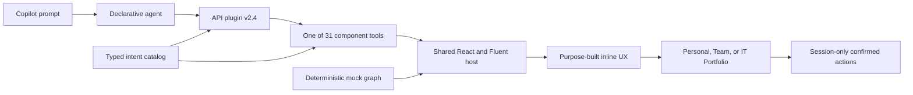

# Zava IT Concierge

Powered by SPFx Copilot Apps

## Summary

Zava IT Concierge is an employee IT self-service Copilot App built with SharePoint Framework 1.24 Copilot Components. It turns device support, hardware requests, manager approvals, service health, and fleet operations into interactive work inside the Microsoft 365 Copilot canvas.

The solution contains 30 independently routed operational tools plus one searchable capability explorer. Every tool can expand into one connected Personal, Team, or IT Portfolio dashboard while preserving the initiating intent and safe prompt-derived context.

> [!IMPORTANT]
> The sample uses deterministic offline data and session-only confirmed actions. Prompt values can filter or prefill a component, but they never submit, approve, decline, delegate, declare, wipe, or apply a refresh plan without visible review and confirmation. Live Microsoft Graph, Intune, service-health, procurement, shipment, and finance integrations are intentionally deferred.
>
> The canonical production gate passes eight suites and 35 tests, validates 39 implementation screenshots, validates the generated 31-function API plugin and mirrored MCP tools, and audits a 2,147,811-byte `.sppkg` with no stale output, duplicate media, or icon-font payload.

## Applies To

- SharePoint Framework 1.24 Copilot Components
- Microsoft 365 Copilot declarative agents and API plugin v2.4
- React 17 and Fluent UI React v9

## At a Glance

| Metric | Delivered |
| --- | --- |
| Prompt-addressable tools | 31: 30 operational tools plus capability exploration |
| Conversation starters | 6, each targeting one tool; explorer last |
| Full-screen dashboards | 3: Personal, Team, and IT Portfolio |
| Shared production entries | 1 initial 464,014-byte entry, with purpose-gated lazy dashboard, chart, and geography chunks |
| Deterministic data | 150 employees, 180 devices, 10 catalog SKUs, and 300 tickets |
| Publication screenshots | 39 real implementation captures |
| Local tests | 8 suites and 35 tests |
| Production package | 2,147,811 bytes; one primary entry and 44 lazy chunks |
| Data mode | Offline mocked graph with session-only receipts |

## Screenshots


## Experience Model

### Inline

Each catalog intent owns one SPFx Copilot Component, immutable GUID, generated manifest, positive and negative routing boundary, optional Zod property schema, preview data, and focused React composition. The shared header presents the Zava IT Concierge brand and action title, with a stable **Full screen** control in the top-right corner.

Prompt-derived values visibly affect filters or editable fields. Generic prompt echo and generic decision-insight rails are absent by default. Submit and review tools expose evidence, consequence, rationale, explicit confirmation, and a semantic session receipt.

### Full Screen

The shared shell has three keyboard-operated business lenses:

| Lens | Persona | Purpose |
| --- | --- | --- |
| Personal | Megan Bowen | Device continuity, support, requests, and next-device choices |
| Team | Diego Siciliani | People readiness, approvals, policy, budget, and support load |
| IT Portfolio | Lee Gu | Estate risk, service continuity, incidents, spend, licenses, and refresh capacity |

All 31 origins map to one owning dashboard. The shell preserves the initiating intent and safe properties, provides useful defaults for every lens, and returns to the conversation through the host display-mode contract.

## Routing and Conversation Starters

[Zava-IT-Concierge-Prompt-Matrix.md](Zava-IT-Concierge-Prompt-Matrix.md) contains copy/paste prompts, optional property previews, full-screen routes, and collision boundaries for all 31 tools. It is generated from the canonical catalog and checked during the production build.

| Starter | Expected tool |
| --- | --- |
| Submit a support ticket | `ReportItIssue` |
| Diagnose my Surface | `RunDeviceDiagnostics` |
| Review approval queue | `GetApprovalQueue` |
| Inspect fleet health | `GetFleetHealth` |
| Correlate an incident | `CorrelateMajorIncident` |
| Explore capabilities | `ExploreAgentCapabilities` |

Agent instructions require one tool for the primary request. Specific task language wins over broad discovery language, and the explorer never advertises itself.

## Architecture



Key implementation choices:

- `src/shared/intents/intentCatalog.ts` is the source of truth for tools, routes, schemas, preview values, education metadata, and visual identities.
- `scripts/configure-intent-components.mjs` regenerates component bindings, manifests, the agent registration, and six starters.
- React DOM and SVG render forms, queues, journeys, product experiences, and compact analytical views.
- Lazy D3 scale/shape modules support compact charts; D3 Geo, TopoJSON, and Natural Earth data render the estate map.
- Babylon is reserved for genuinely dimensional full-screen scenes. Inline components create zero WebGL engines.
- One seeded mock graph keeps employee, manager, and IT operations evidence coherent.

## Mock and Safety Disclosure

This repository is a demonstration sample, not a production IT system.

- Business data is generated locally and deterministic.
- Runtime product and persona media is package-hosted; the experience does not fetch media at runtime.
- Confirmed demo actions append session-only receipts and do not call tenant APIs.
- Controls that resemble export, copy, approval, submission, or planning behavior remain mocked or session-local unless their visible state says otherwise.
- Replace service interfaces with authenticated, authorized, audited adapters before production use.

## Accessibility and Worldwide Scope

The implementation uses semantic headings, keyboard-operated lens tabs and chart marks, named form fields, visible required states, non-color status labels, exact-value evidence, reduced-motion behavior, responsive layouts, and initials fallbacks for portraits. Currency, numbers, and dates use `Intl`-based formatting where applicable.

The Playwright publication harness checks all 31 inline defaults plus representative full-screen, mobile, dark, detail, confirmation, and receipt states for broken images, horizontal overflow, deprecated generic chrome, page errors, and console errors. Authenticated Copilot iframe focus, tenant high contrast, and screen-reader output remain tenant-only validation gates.

## Test in Tenant Copilot Workbench

Use the authenticated Copilot Workbench in your Microsoft 365 developer tenant as the primary development and debugging experience.

### Prerequisites

- Node.js `>=22.14.0 <23.0.0`
- Access to a Microsoft 365 tenant that supports SPFx 1.24 Copilot Components

```powershell
npm install
$env:SPFX_SERVE_TENANT_DOMAIN = "contoso.sharepoint.com"
heft start --nobrowser
```

Replace `contoso.sharepoint.com` with your tenant domain and keep the terminal running. Then open this URL, replacing `<tenant>` with the same tenant name:

```text
https://<tenant>.sharepoint.com/_layouts/CopilotWorkbench.aspx?debugManifestsFile=https%3A%2F%2Flocalhost%3A4321%2Ftemp%2Fbuild%2Fmanifests.js&debug=true&noredir=true
```

Allow debug scripts if prompted, start a fresh Workbench conversation, and use a prompt from [Zava-IT-Concierge-Prompt-Matrix.md](Zava-IT-Concierge-Prompt-Matrix.md). Verify the inline component first, then select **Full screen** to test its Personal, Team, or IT Portfolio continuation. Source changes rebuild automatically; refresh or start a new Workbench turn to test the update. Press `Ctrl+C` when finished.

If the browser does not trust the localhost development certificate, run `heft trust-dev-cert` once and restart the development server.

## Build and Package

Run the canonical production gate before sharing or deploying the solution:

```powershell
npm run build
```

The canonical build validates routing, local assets, gallery metadata, and generated documentation; runs the clean production test suite; packages the solution; validates the generated 31-function API plugin and mirrored MCP tools; and audits the `.sppkg` for stale output, hashes, bundle/chunk strategy, duplicate media, icon fonts, and size thresholds.

The ready-to-deploy package is [sharepoint/solution/zava-it-concierge.sppkg](sharepoint/solution/zava-it-concierge.sppkg).

## Minimal Path to Awesome

1. Deploy [sharepoint/solution/zava-it-concierge.sppkg](sharepoint/solution/zava-it-concierge.sppkg) to the tenant app catalog, or build it locally with `npm run build`.
2. Add the generated Zava IT Concierge agent to Microsoft 365 Copilot.
3. Start a fresh conversation and use a prompt from [Zava-IT-Concierge-Prompt-Matrix.md](Zava-IT-Concierge-Prompt-Matrix.md).
4. Verify that the expected single component renders and prompt-derived values are visible and editable.
5. Use **Full screen** to verify exact Personal, Team, or IT Portfolio continuation.

### Tenant package walkthrough

[](https://www.youtube.com/watch?v=4asOZi4PNUQ)

[Watch on YouTube](https://www.youtube.com/watch?v=4asOZi4PNUQ)

## Optional Local Visual Review

The local visual harness is a secondary option for focused layout checks and publication screenshot work. It does not replace validation in the authenticated tenant Copilot Workbench.

Install Chromium once if you need screenshot regeneration:

```powershell
npx playwright install chromium
```

Run the React surfaces without a tenant:

```powershell
npm run start:visual
```

Open `localhost:4173`. Query parameters select an intent, theme, and display mode, for example:

```text
?intent=GetFleetHealth&theme=dark&mode=fullscreen
```

Regenerate and validate publication evidence with:

```powershell
npm run capture:visual
npm run check:gallery
```

See [assets/README.md](assets/README.md), [assets/sample.json](assets/sample.json), [assets/visual-evidence.json](assets/visual-evidence.json), [assets/release-evidence.json](assets/release-evidence.json), and [assets/asset-provenance.json](assets/asset-provenance.json).

## Demo Scripts

- [3-minute keynote demo](Zava-IT-Concierge-3-Minute-Demo.md)
- [10-minute business-value demo](Zava-IT-Concierge-10-Minute-Business-Demo.md)
- [5-minute technical demo](Zava-IT-Concierge-5-Minute-Technical-Demo.md)

## Production Validation Commands

| Command | Purpose |
| --- | --- |
| `npm run validate:intents` | Validate 31 catalog entries, generated components, one bundle, and six starters |
| `npm run validate:assets` | Verify runtime and design asset provenance hashes |
| `npm run check:routing-matrix` | Verify the prompt/property/collision matrix is current |
| `npm run capture:visual` | Capture 39 real implementation screenshots and runtime evidence |
| `npm run check:gallery` | Validate PnP metadata, files, dimensions, URLs, alt text, and coverage |
| `npm run check:generated-plugin` | Validate API plugin v2.4 functions and mirrored MCP tools |
| `npm run check:package-output` | Audit final package contents, hashes, sizes, stale output, and duplication |
| `npm run build` | Run the canonical clean production and packaging gate |

## Version History

| Version | Date | Comments |
| --- | --- | --- |
| 1.0.0 | August 25, 2026 | Initial publication with 31 tools, three dashboards, deterministic evidence, demos, and package audits |

## References

- [Build your first SharePoint Copilot App](https://learn.microsoft.com/sharepoint/dev/spfx/copilot/get-started/build-your-first-copilot-app)
- [SharePoint Framework overview](https://learn.microsoft.com/sharepoint/dev/spfx/sharepoint-framework-overview)
- [Microsoft 365 Copilot](https://www.microsoft.com/microsoft-365/copilot)

## Disclaimer

**THIS CODE IS PROVIDED AS IS WITHOUT WARRANTY OF ANY KIND, EITHER EXPRESS OR IMPLIED, INCLUDING ANY IMPLIED WARRANTIES OF FITNESS FOR A PARTICULAR PURPOSE, MERCHANTABILITY, OR NON-INFRINGEMENT.**


